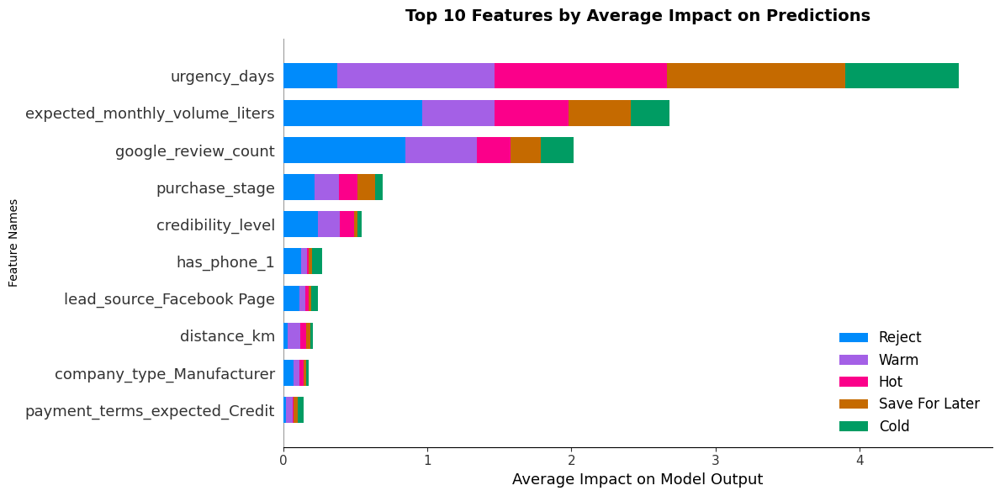
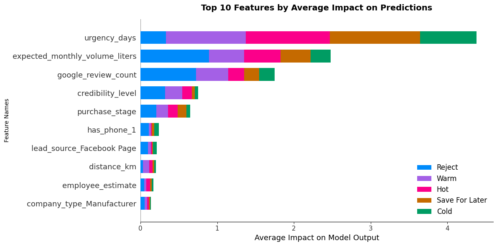

# Executive Summary

This project develops a **Lead Evaluator** system for **Swan Chemical Ltd.** to support faster and more consistent sales prioritization in the adhesives business. The model predicts a lead’s **bucket**—Hot, Warm, Cold, Save For Later, or Reject—based on operational feasibility, commercial potential, and credibility signals. In addition to the bucket prediction, the system produces a probability-based **lead score** (**QualifiedScore = P(Hot) + P(Warm)**) and maps it to simple actions (**Prioritize**/**Nurture**/**Deprioritize**)
for practical business use.

Multiple multi-class models were trained and compared, including **Multinomial Logistic Regression**, **Random Forest**, **LightGBM**, **HistGradientBoosting**, and **CatBoost**. Model performance was evaluated using multi-class-appropriate metrics such as **Macro F1**,
cross-validation stability, and ROC-AUC (OVR and Qualified-vs-Not). After comparison and tuning, **CatBoost** was selected as the final production model due to its strongest overall performance and improved generalization after hyperparameter tuning.

**The tuned CatBoost model achieved:**

* **Macro F1 (Test):** 78.15%
* **OVR Macro AUC:** 95.63%
* **Overfitting:** Train–Test Macro F1 gap reduced to **5.96%** after tuning

Explainability was supported through **feature importance** and **SHAP** analysis, showing that the model is primarily driven by high-signal business variables such as **urgency**, **expected monthly volume**, and **credibility indicators** (e.g., Google review count), aligning well with real-world sales logic.

# Business Problem

Sales teams often receive numerous inquiries, but not all leads are worth the equal effort. Some companies are genuinely high-potential buyers, while others are low-volume, unready, unreachable, or unreliable. Spending time on poor-fit leads increases cost and delays follow-up on qualified opportunities.

The core business question addressed in this project is:

> ***Can we predict whether an incoming company inquiry is a high-potential lead and prioritize it using measurable lead characteristics?***

A reliable lead evaluation system helps Swan Chemical Ltd.:
* Focus sales effort on the highest-value opportunities
* Reduce time wasted on low-quality or non-serviceable leads
* Standardize lead assessment to reduce human subjectivity
* Improve response speed and customer experience through quicker triage

# Methodology

## Data Preparation

The dataset was designed to simulate the information a real sales team can collect at the lead stage. It includes operational variables (distance, urgency), commercial variables (expected demand, order frequency), and credibility/intent signals (purchase stage, credibility level, online presence).

### Feature Engineering & Encoding

**To prepare the data for modeling:**
1. **Ordinal variables** (where order matters) were encoded using **Ordinal Encoding**, including`employee_estimate`, `credibility_level`, and `purchase_stage`.
2. **Nominal categorical variables** were encoded using **One-Hot Encoding**.
3. **Numeric variables** were standardized using **StandardScaler** where appropriate.
4. The pipeline was designed to avoid leakage by fitting encoders/scalers only on training data and transforming test data using the fitted artifacts.

## Model Training & Performance Evaluation

We trained and compared **five** multi-class classification models:
1. Multinomial Logistic Regression
2. Random Forest Classifier
3. LightGBM Classifier
4. HistGradientBoosting Classifier and
5. CatBoost Classifier

All models were evaluated on the held-out test set using:
* Accuracy
* Precision
* Recall
* F1-score
* Macro F1 **(primary metric)**
* OVR ROC-AUC **(Macro and Weighted)**
* Qualified-vs-Not ROC-AUC **(Hot/Warm vs others)**
* Overfitting check **(Train–Test Macro F1 gap)**
* 5-Fold Cross Validation **(Accuracy and Macro F1)**

## Model Selection & Validation Strategy

Because this is a **multi-class** and **business-prioritization**
problem, the selection emphasized metrics that reflect balanced class
performance and generalization:

1.  **Macro F1 as the primary metric** (prevents the model from ignoring
    minority classes like Hot)
2.  **Cross-validation stability** to ensure reliability across
    different splits
3.  **Overfitting checks** using Train–Test Macro F1 gap
4.  **AUC-based ranking quality**, especially for “Qualified vs Not
    Qualified” triage

From the comparison, **CatBoost** consistently performed best across Macro F1 and AUC metrics while maintaining strong generalization after
tuning.

### Model Comparison Summary
A summary of model performance of the **five** models is presented below:

***Table 01:** All Model Performance Summary.*
| **Rank** | **Model** | **Macro F1** | **Weighted F1** | **Accuracy** | **Overfitting** | **CV Mean F1** | **CV Std** | **OVR Macro AUC** | **OVR Weighted AUC** | **Qual-vs-Not AUC** | **Hot + Warm Recall** |
|:---:|:---|:---:|:---:|:---:|:---:|:---:|:---:|:---:|:---:|:---:|:---:|
| 1 | **CatBoost** | **78.38%** | **78.48%** | **78.78%** | **21.50%** | **0.7804** | **0.0262** | **95.29%** | **94.77%** | **99.01%** | **81.63%** |
| 2 | LightGBM | 73.76% | 74.49% | 74.78% | 26.24% | 0.7665 | 0.0158 | 94.21% | 93.69% | 98.93% | 76.19% |
| 3 | HistGradientBoosting | 73.38% | 74.29% | 74.56% | 26.62% | 0.7566 | 0.0250 | 94.06% | 93.62% | 98.93% | 74.15% |
| 4 | Logistic Regression | 71.65% | 72.95% | 73.33% | 7.81% | 0.7095 | 0.0104 | 93.46% | 92.85% | 98.87% | 72.45% |
| 5 | Random Forest | 69.06% | 73.22% | 75.44% | 8.17% | 0.6570 | 0.0231 | 94.51% | 93.83% | 98.85% | 73.47% |

# Final Model Tuning & Selection

The CatBoost model was tuned using **RandomizedSearchCV** to improve performance and reduce overfitting.

## Best Parameters (RandomizedSearchCV)

The final tuned model used the following best parameters:
* `depth = 5`
* `learning_rate = 0.01`
* `iterations = 1500`
* `l2_leaf_reg = 8`
* `subsample = 0.7`
* `rsm = 0.7`
* `random_strength = 1`
* `border_count = 255`

### Key Takeaways

* Best cross-validation Macro F1 during search: **0.7851**
* Overfitting reduced substantially compared to baseline CatBoost
* Final tuned model showed strong balance across all lead buckets

## Model Performance

***Table 02:** Tuned CatBoost Model Performance Summary.*
| **Metric** | **Test/CV Performance** |
|------------|----------------------------|
| ***Macro F1 (Test)*** | **78.15%** |
| ***Macro F1 (Train)*** | **84.10%** |
| ***Cross-Validation Macro F1 (Mean ± Std)*** | **0.7772 ± 0.0247** |
| ***OVR ROC-AUC (Macro)*** | **95.63%** |
| ***OVR ROC-AUC (Weighted)*** | **95.13%** |
| ***Qualified-vs-Not ROC-AUC*** | **99.16%** |
| ***Overall Accuracy (Test)*** | **79.00%** |
| ***Hot + Warm Recall (Test)*** | **82.13%** |
| ***Train–Test Macro F1 Difference (Overfitting*)*** | **5.96%** |
| ***Overfitting Status*** | **Good** |
| ***Best Tuned Parameters (RandomizedSearchCV)*** | `depth = 5`, `lr = 0.01`, `iters = 1500`, `l2 = 8`, `subsample = 0.7`, `rsm = 0.7` |

***Overfitting criteria (based on Train–Test Macro F1 gap):** Good (<10%), Moderate (10–20%), High (>20%)

### Key Insights

* The tuned CatBoost model delivers strong balanced classification performance across all five buckets, validated by Macro F1.
* Overfitting is low (5.96% gap), indicating solid generalization to unseen lead profiles.
* High AUC values confirm strong ranking ability, especially for the core business triage decision: identifying qualified opportunities (Hot/Warm).

## Top Features

**Methodology:** Both **SHAP (Shapley Additive exPlanations)** values and **native CatBoost feature importance rankings** were used to identify key revenue drivers through bar charts, beeswarm plots, and numerical importance scores.

***Figure 01:** Across the entire dataset, which features matter the most on average?*

***Figure 02:** For one specific company, why did the model predict a particular value??*

### Key Findings
Across the three explanation lenses—**CatBoost split-based importance**, **SHAP average impact (global)**, and a **SHAP waterfall (individual case)**—a consistent story emerges: **lead urgency drives prioritization**, **expected demand determines commercial value**, and **credibility signals refine borderline decisions rather than override the core drivers.**

* **Urgency is the dominant driver of lead prioritization:** `urgency_days` ranks as the clear number 01 feature in both CatBoost importance and SHAP global impact. In the waterfall example, it contributes the largest positive shift, indicating that near-term demand strongly pushes leads toward **Warm/Hot** classifications.

* **Expected monthly volume is the main “value” signal:** `expected_monthly_volume_liters` consistently appears as a top-tier feature. Globally, it has high average SHAP impact, and in the single-company waterfall it can pull predictions downward when volume is modest—often preventing a lead from reaching **Hot** even when urgency is high.

* **Business legitimacy signals matter, but as secondary evidence:** `google_review_count` is a strong global feature and a positive contributor in the waterfall plot, acting as a proxy for company footprint and credibility. It amplifies confidence in **Warm/Hot** outcomes but rarely outweighs urgency and demand.

* **Buying intent and trust refine borderline cases:** `purchase_stage` and `credibility_level` appear in both importance rankings and SHAP top features. Their impacts are smaller than the top three, but they meaningfully separate close calls such as **Warm vs Save For Later**.

* **Operational and contactability filters provide incremental adjustments:** Features like `distance_km` and `has_phone_1` show relatively low global impact, suggesting they act as tie-breakers (serve-ability and reachability) rather than primary decision drivers.

**Key Takeaway:** 
Lead qualification in this model is fundamentally **urgency-led** and **value-shaped**. Credibility and intent signals improve confidence and help resolve borderline cases, while operational factors fine-tune decisions without driving them.

# Model Deployment & Testing

The **`lead_evaluator.ipynb`** notebook serves as the development environment for cleaning, training, evaluation, and tuning. For business-side usage, the model is deployed through saved artifacts and lightweight scripts:

1.  All fitted components (CatBoost model, encoders, scaler, metadata) are saved into the [**`artifacts`**](./artifacts/) folder.
2.  A production module [**`lead_evaluator.py`**](./lead_evaluator.py) loads these artifacts and exposes a clean `predict_leads()` function.
3.  A runner script [**`scoring.py`**](./scoring.py) reads a CSV of new leads and outputs:
    * Predicted lead bucket
    * Probability-based lead score (QualifiedScore)
    * Recommended action (Prioritize / Nurture / Deprioritize)

This separation allows real usage without exposing training code.

# Conclusion

This project delivered a practical MVP that transforms lead information into clear, business-ready outputs. The tuned CatBoost model provides strong multi-class performance, low overfitting, and excellent separation for qualified vs non-qualified leads. Combined with a probability-based lead score and an action rule, the system is suitable for real-world lead triage and can be improved further as Swan Chemical Ltd. accumulates real lead outcomes and feedback.

