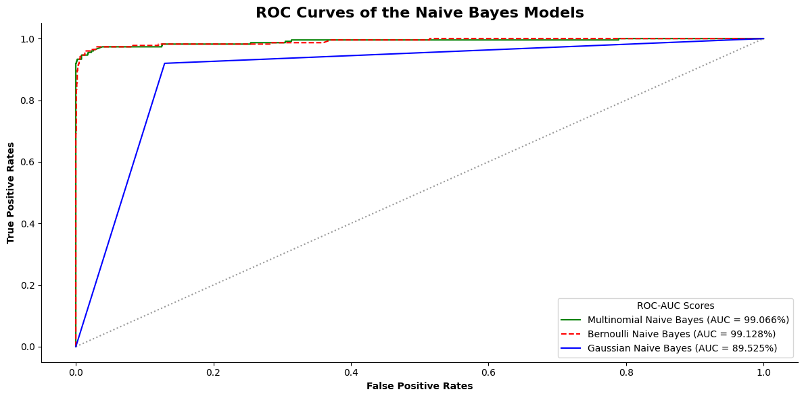

# Project 01: Understanding & Explaining a Machine Learning Algorithm

<div style="text-align: justify;">

In this project, we explored the three **Naive Bayes Classifier** algorithms—Multinomial, Bernoulli, and Gaussian. The dataset used here is the **SMS Spam Collection Dataset** from the UCI Machine Learning Repository, which has around 87% ham messages and 13% spam messages.

## Data Preparation
We first take a visual of the distribution of ham and spam messages in the dataset. This ratio will later help us in forming a stratified split for training and testing datasets.


***Figure 01:** Ham vs. Spam Distribution.*

As can be seen from the pie chart above, the dataset is imbalanced with a higher proportion of ham messages compared to spam messages. So, we will preserve this imbalance in our training and testing datasets with the code `stratify = sms["label_encoding"]`.

Now, we encode the variables. The three naive bayes models require different types of encoders. For example:
* **Multinomial Naive Bayes** requires the `CountVectorizer` encoder. This encoder converts the text data into a matrix of token counts. For example, if the word **free** appears 3 times in a message, the corresponding entry in the matrix will be 3.
* **Bernoulli Naive Bayes** works with the same encoder but with the binary option set to true, i.e., `CountVectorizer(binary = True)`. This means that the matrix will contain binary values (0 or 1) indicating the presence or absence of a word in a message. Taking the same example, if the word **free** appears 3 times in a message, the corresponding entry in the matrix will be `1` (Present).
* Finally, **Gaussian Naive Bayes** uses the `TfidfVectorizer` encoder. This model assumes that the features follow a normal distribution. Therefore, it requires the text data to be represented as continuous values. The results are later converted into arrays.

## Model Training & Evaluation
Now, we import the necessary liraries from scikit-learn, build the model objects, fit the train data, and predict the test data. Then, we evaluate the models using a bunch of metrics. Some of them are: accuracy, precision, recall, F1-score, and ROC-AUC score.

### Accuracy & Classification Report
The accuracy scores along with their classification reports (precision, recall, F1-score) of the three models on the test dataset are as follows:
Their results are tabulated below:

***Table 01:** Model Performance Comparison.*
| Model | Accuracy | Class | Precision | Recall | F1-Score | Support |
|:------|:----------|:-------|:-----------|:--------|:----------|:----------|
| ***MultinomialNB*** | **98.68%** | Ham (0) | 0.99 | 1.00 | 0.99 | 1448 |
|  |  | **Spam (1)** | **0.97** | **0.93** | **0.95** | **224** |
|  |  | Macro Avg | 0.98 | 0.96 | 0.97 | — |
|  |  | Weighted Avg | 0.99 | 0.99 | 0.99 | — |
| ***BernoulliNB*** | **97.19%** | Ham (0) | 0.97 | 1.00 | 0.98 | 1448 |
|  |  | **Spam (1)** | **0.99** | **0.79** | **0.88** | **224** |
|  |  | Macro Avg | 0.98 | 0.90 | 0.93 | — |
|  |  | Weighted Avg | 0.97 | 0.97 | 0.97 | — |
| ***GaussianNB*** | **87.74%** | Ham (0) | 0.99 | 0.87 | 0.92 | 1448 |
|  |  | **Spam (1)** | **0.52** | **0.92** | **0.67** | **224** |
|  |  | Macro Avg | 0.76 | 0.90 | 0.80 | — |
|  |  | Weighted Avg | 0.92 | 0.88 | 0.89 | — |

#### <u>Key Insights</u>:
* For detecting spam messages (class 1), **Multinomial Naive Bayes** achieved the best balance with precision = 0.97, recall = 0.93, and F1 = 0.95, correctly identifying most spam messages with very few false alarms.

* **Bernoulli Naive Bayes** had slightly higher precision (0.99) but much lower recall (0.79), missing more spam messages.

* **Gaussian Naive Bayes** performed the worst on spam detection, with low precision (0.52) despite good recall (0.92), meaning it incorrectly labeled many ham messages as spam.

### Confusion Matrices
We generated the three confusion matrices for the models and displayed them side-by-side for an easier comparison.


***Figure 02:** Confusion Matrices.*

#### <u>Key Insights</u>:
Now, our goals are to either have the minimum number false positive or false negative predictions. Depending on the context and what we want to achieve, we can choose to prioritize one over the other.

* If our objective is to minimize false positives, i.e., we want to avoid incorrectly identifying a ham message as spam, then the best model would be the one with the lowest false positive rate. In this case, that model here is the **Bernoulli Naive Bayes** model (only 1 out of 1448). We must choose this model if we absolutely cannot afford to lose important emails (like business communications, bank notifications, etc.).

* On the other hand, if our objective is to minimize false negatives, i.e., we want to avoid incorrectly identifying a spam message as ham, then the best model would be the one with the lowest false negative rate. In this case, that model here is the **Multinomial Naive Bayes** model (only 15 out of 224). We will choose this model if security and avoiding malicious content is our priority.

* If we are looking for a balance between the false positive and false negative on the other hand, **Multinomial Bayes Model** is the best among the three. It catches almost the majority of the spam messages (209 messages in true positive) whilst having the least number of false negative messages and second least number of false positive messages.

### ROC Curves & ROC-AUC Scores
We also plotted the ROC curves of all three models together for a visual comparison. The ROC-AUC scores are also mentioned in the legend.


***Figure 03:** ROC Curves & ROC-AUC Scores.*

#### <u>Key Insights</u>:
* The ROC curves show that **Multinomial Naive Bayes** and **Bernoulli Naive Bayes** both achieved excellent discrimination ability between spam and ham messages, with AUC scores of 99.066% and 99.128% respectively. They can be considered almost equal if we account for the decimal places. Their ROC curves nearly touch the top-left corner, indicating near-perfect classification performance.

* In contrast, **Gaussian Naive Bayes** performed notably worse, with an AUC of 89.53%, showing that it is less effective at distinguishing between the two classes.

## Overfitting Check
Before finally selecting on a model, we want to check whether any of the models have any overfitting issues. Usually one of the taletell signs of overfitting is **a large difference between the training and testing accuracies of a model**. If a model has a very high training accuracy but a significantly lower testing accuracy, it may be overfitting the training data.

```
Train & Test Accuracy and their Differences

For Multinomial Naive Bayes
Train Accuracy: 99.36%
Test Accuracy: 98.68%%
Difference in accuracy: 0.67%

For Bernoulli Naive Bayes
Train Accuracy: 98.51%
Test Accuracy: 97.19%
Difference in accuracy: 1.32%

For Gaussian Naive Bayes
Train Accuracy: 93.77%
Test Accuracy: 87.74%
Difference in accuracy: 6.03%
```

#### <u>Key Insights</u>:
* For detecting spam messages (class 1), **Multinomial Naive Bayes** achieved the best balance with precision = 0.97, recall = 0.93, and F1 = 0.95, correctly identifying most spam messages with very few false alarms.

* **Bernoulli Naive Bayes** had slightly higher precision (0.99) but much lower recall (0.79), missing more spam messages.

* **Gaussian Naive Bayes** performed the worst on spam detection, with low precision (0.52) despite good recall (0.92), meaning it incorrectly labeled many ham messages as spam.

### Cross-Validation Check

<div style="text-align: justify;">

Now, we want to have another check on how our models perform on new and unseen data. Another method of testing this is through cross-validation.

For this dataset, we perform a **k-Fold Cross Validation**, For our use case, we use a `k = 5`, i.e., a 5-Fold Cross Validation.

```
Cross Validation Results of the Three Models

Multinomial Naive Bayes: 97.59% ± 0.53%
Bernoulli Naive Bayes: 97.08% ± 0.38%
Gaussian Naive Bayes: 87.05% ± 1.00%
```


***Figure 04:** Cross-Validation Results.*

#### <u>Key Insights</u>:
Among the three models, **Multinomial Naive Bayes** achieved the highest and most consistent performance (97.59% ± 0.53%), followed closely by **Bernoulli Naive Bayes** (97.08% ± 0.38%), while **Gaussian Naive Bayes** lagged far behind. Both MultinomialNB and BernoulliNB demonstrated excellent generalisation and stability across folds, indicating strong generalization and low variance. They also confirmed that the models are not overfitting and perform consistently across multiple splits of the data. GaussianNB, however, performed worse due to its assumption of continuous, normally distributed features, which does not align with text-based TF-IDF or count data.

To check their performance across the folds, we can visualize the results using a heatmap.


***Figure 05:** Cross-Validation Heatmap.*

### Final Model Selection
Finally, we want to compare the performance of the three models across **three** specific metrics: Accuracy, F1-Score, and ROC-AUC Score. We will create a bar plot for each metric to visually compare the models.


***Figure 06:** Final Model Comparison.*

#### <u>Key Insights</u>:
As we can see from the barchart above, **Multinomial Naive Bayes** scored the highest in Accuracy and F1 Score (Spam) whereas **Bernoulli Naive Bayes** scored the highest in the ROC-AUC Score with MultinomialNB trailing very closely behind. **Gaussian Naive Bayes** scored the lowest in all three metrics. 

Comparing from this chart, we can conclude that **Multinomial Naive Bayes** is the best model among the three.

## Conclusion

So, from the above comparison(s), graphs, and confusion matrixes, we can see that **Multinomial Naive Bayes** performed the best in classifying spam texts compared to the other two. It makes the perfect sense since it accounts for how many times one word appears in a text. Gaussian Naive Bayes performed poorly because this dataset was a text-based one and GNB performs the best in numeric features. Although the dataset was encoded using TF-IDF, this model was not the best one for this dataset.

**Performance of MNB**:

| Metric | Value |
|:-------|:------|
| Accuracy |  98.68%|
| Precision |  97%|
| Recall |  93%|
| F1-score |  95%|
| False Positive Rate |  0.48%|
| False Negative Rate |  6.70%|
| ROC-AUC |  99.07%|

<u>So, to rank the performance of the **three** models</u>:
1. Multinomial Naive Bayes
2. Bernoulli Naive Bayes
3. Gaussian Naive Bayes

</div>