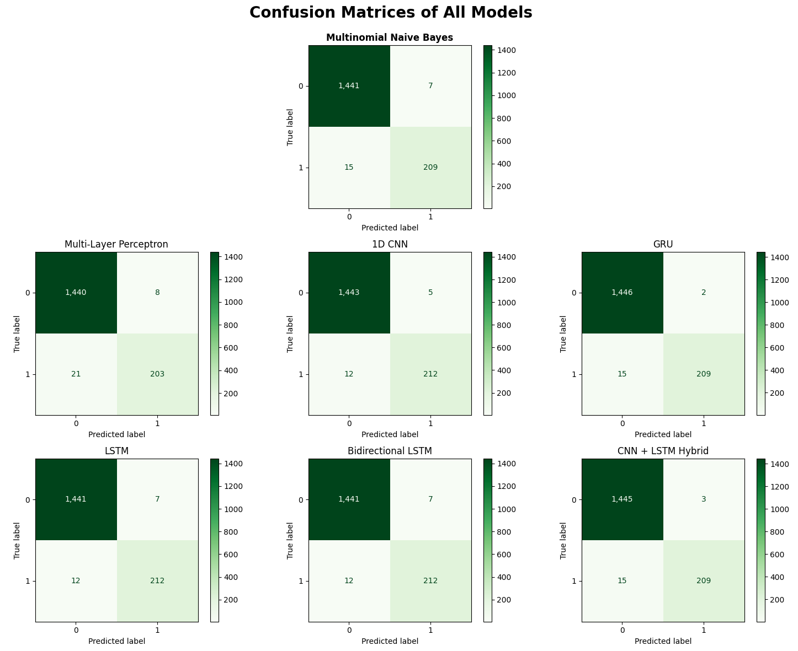

# Executive Summary

This project aims to compare the performance of the Naive Bayes classifiers—**Multinomial Naive Bayes** to be exact—with various neural network architectures including **1D CNN**, **LSTM**, **BiLSTM**, **GRU**, and a **CNN + LSTM Hybrid** model for SMS spam detection using the SMS Spam Collection Dataset from the UCI Machine Learning Repository. This project is an extension of the [first project](https://github.com/tasnimtalha09/applied-machine-learning-for-business/tree/main/Project%2001%20—%20Understanding%20%26%20Explaining%20a%20Machine%20Learning%20Algorithm) where we explored and compared three Naive Bayes models.

The dataset contained roughly **87% ham** and **13% spam**, showing a natural imbalance. The analysis focused on model performance, overfitting checks, and generalization ability through metrics like **accuracy, precision, recall, F1-score**, and **ROC-AUC**.

***Figure 01:** Ham vs. Spam Distribution.*

# Business Problem
With the rising volume of spam in digital communication, automated detection is critical for both user safety and system efficiency. The business problem addressed is:  

> *Can we accurately classify SMS messages as spam or ham using probabilistic learning methods or neural network models while balancing false positives (legitimate messages flagged as spam) and false negatives (spam messages passing through)?*

This project evaluates **seven** models—one naive bayes model and six neural network architectures—to identify the most effective approach for spam detection. Our goal is to determine which provides the best trade-off between accuracy, recall, and precision for real-world spam filtering applications.

# Methodology

## Data Preparation
As can be seen from the pie chart above, the dataset is imbalanced with a higher proportion of ham messages compared to spam messages. So, we will preserve this imbalance in our training and testing datasets with the code `stratify = sms["label_encoding"]`.

The **seven** models require **three** different types of encoders:
1. **Multinomial Naive Bayes**: `CountVectorizer()`
2. **Multi-Layer Perceptron**: `TfidfVectorizer()`
3. **All The Other Neural Networks**: `Tokenizer()` and `pad_sequences()`

## Model Training & Performance Evaluation
Now, we import the necessary libraries from scikit-learn, build the model objects, fit the train data, and predict the test data. Then, we evaluate the models using a bunch of metrics. Some of them are: accuracy, precision, recall, F1-score, and ROC-AUC score. The **seven** models evaluated are:
1. Multinomial Naive Bayes
2. Multi-Layer Perceptron (MLP)
3. 1D Convolutional Neural Network (CNN)
4. Long Short-Term Memory (LSTM)
5. Bidirectional LSTM (BiLSTM)
6. Gated Recurrent Unit (GRU)
7. CNN + LSTM Hybrid

### Overfitting Check
Before comparing the model performance metrics, we want to check whether any of the models have any overfitting issues. Usually one of the talltale signs of overfitting is **a large difference between the training and testing accuracies of a model**. If a model has a very high training accuracy but a significantly lower testing accuracy, it may be overfitting the training data.

***Table 01:** Train-Test Accuracy Comparison*

| **Model** | **Train-Test Accuracy Gap** |
|:----------|:---------------------------:|
| Multinomial Naive Bayes | 0.68% |
| Multi-layer Perceptron | 1.22% |
| 1D CNN | 0.81% |
| GRU | 0.63% |
| LSTM | 0.88% |
| BiLSTM | 0.88% |
| CNN + LSTM Hybrid | 0.80% |

**Key Insights:**

All models demonstrate strong generalization with train-test accuracy gaps below 1.3%. The **Gated Recurrent Unit** shows the lowest overfitting (0.63%), followed closely by **Multinomial Naive Bayes** (0.68%), while the **Multi-layer Perceptron** exhibits the highest gap (1.22%).

### Model Performance Comparison
A summary of the accuracy, precision, recall, F1-score, ROC-AUC scores, and overfitting check results for the seven models is presented below:

***Table 02:** Model Performance Comparison of Spam (Class 1).*
| **Rank** | **Model** | **Accuracy** | **Precision** | **Recall** | **F1-Score** | **ROC-AUC** | **Overfitting** |
|:--------:|:----------|:------------:|:-------------:|:----------:|:------------:|:-----------:|:---------------:|
| 1 | **1D CNN** | **98.98%** | **97.70%** | **94.64%** | **96.15%** | **99.44%** | **0.81%** |
| 2 | GRU | 98.98% | 99.05% | 93.30% | 96.08% | 99.39% | 0.63% |
| 3 | BiLSTM | 98.86% | 97.67% | 94.64% | 96.13% | 99.31% | 0.88% |
| 4 | LSTM | 98.86% | 97.67% | 94.64% | 96.13% | 99.25% | 0.88% |
| 5 | CNN + LSTM | 98.86% | 98.62% | 93.30% | 95.89% | 99.33% | 0.80% |
| 6 | **MNB** | **98.68%** | **96.76%** | **93.30%** | **95.00%** | **99.07%** | **0.68%** |
| 7 | MLP | 98.27% | 96.12% | 93.75% | 94.92% | 99.30% | 1.22% |

**Key Insights:**

The **1D CNN** emerged as the best-performing model, achieving the highest accuracy (98.98%), best F1-score (96.15%), and top ROC-AUC (99.44%), while maintaining low overfitting (0.81%), correctly identifying the most spam with only 12 false negatives. Despite ranking 6th, **Multinomial Naive Bayes** remains highly competitive with 98.68% accuracy and minimal computational overhead—only the **MLP** performed worse. The performance spread across all models is narrow (0.71 percentage points), suggesting that for resource-constrained applications, MNB is a practical choice, while the 1D CNN is preferred when maximum recall and F1-score are critical.

### Confusion Matrices
We combined all the confusion matrices of the seven models into a single plot for easier comparison.

***Figure 02:** Confusion Matrices.*

**Key Insights:**

Now, our goals are to either have the minimum number false positive or false negative predictions. Depending on the context and what we want to achieve, we can choose to prioritize one over the other.

* **Minimize false positives** *(ham messages incorrectly predicted as spam)*: The **GRU** and **CNN + LSTM Hybrid** perform best with only **2** and **3** false positives respectively, making them ideal when avoiding unnecessary spam flagging is critical.  
* **Minimize false negatives** *(spam messages incorrectly predicted as ham)*: The **1D CNN**, **LSTM**, and **BiLSTM** lead with only **12** false negatives each, meaning they miss the fewest spam messages among all models.  
* **Overall best model:** The **CNN + LSTM Hybrid** offers strong overall performance with the second-lowest false positives (**3**) and a competitive false negative count (**15**), achieving a good balance between catching spam and avoiding false alarms.

## Best Model Selection
Based on the comprehensive evaluation of all models across multiple performance metrics, the **1D Convolutional Neural Network (1D CNN)** emerges as the optimal choice for spam detection on the SMS Spam Collection dataset. This model achieves the highest accuracy (tied with GRU), best F1-score, highest ROC-AUC, and best recall, making it the most reliable and effective option for this classification task. It also has the best balance between minimizing false positives and false negatives, which is crucial for maintaining user trust while effectively identifying spam messages.

If we put the numbers of 1D CNN and Multinomial Naive Bayes side by side, we get the following table:

***Table 03:** 1D CNN vs. Multinomial Naive Bayes Performance Comparison.*

| ***Metric*** | **Multinomial Naive Bayes** | **1D CNN** | **Better Model** |
|:-----------|:---------------------------:|:---------------------:|:--------------:|
| ***Accuracy*** | 98.68% | 98.98% | 1D CNN |
| ***Precision*** | 96.76% | 97.70% | 1D CNN |
| ***Recall*** | 93.30% | 94.64% | 1D CNN |
| ***F1-Score*** | 95.00% | 96.15% | 1D CNN |
| ***ROC-AUC*** | 99.07% | 99.44% | 1D CNN |
| ***False Positive Rate*** | 0.48% | 0.35% | 1D CNN |
| ***False Negatives*** | 6.70% | 5.36% | 1D CNN |
| ***Overfitting*** | 0.67% | 0.81% | MNB |

For a quick summary, here are the key performance metrics of the **1D CNN** model:
* **Accuracy:** 98.98%. Tied for highest among all models, indicating superior overall correctness
* **Precision:** 97.70%. Strong at minimizing false positives, crucial for user trust
* **Recall:** 94.64%. Best at capturing spam messages, with only 12 false negatives
* **F1-Score:** 96.15%. Highest among all models, reflecting the best balance between precision and recall
* **ROC-AUC:** 99.44%. Highest among all models, indicating excellent class separability
* **Overfitting Measure:** 0.81%. Low overfitting, demonstrating good generalization to unseen data

# Conclusion

This project successfully compared **Multinomial Naive Bayes** against **six neural network architectures** for SMS spam detection, demonstrating that while deep learning models can outperform traditional probabilistic classifiers, the performance gains are incremental rather than dramatic on this text classification task.

The **1D Convolutional Neural Network (1D CNN)** emerged as the best-performing model, achieving **98.98% accuracy**, **97.70% precision**, **94.64% recall**, and a **96.15% F1-score**—surpassing Multinomial Naive Bayes across all metrics. The 1D CNN's ability to detect **local patterns** such as spam-indicative keywords and short phrases (n-grams) through convolution filters proved most effective for this classification task, while maintaining strong generalization with only **0.81% overfitting**.

**Final Model Ranking by Accuracy**:
1. **1D Convolutional Neural Network (98.98%)**
2. Gated Recurrent Unit (98.98%)
3. Bidirectional LSTM (98.86%)
4. Long Short-Term Memory (98.86%)
5. CNN + LSTM Hybrid (98.86%)
6. **Multinomial Naive Bayes (98.68%)**
7. Multi-Layer Perceptron (98.27%)

**Key Takeaway:** Despite Multinomial Naive Bayes ranking 6th, its **98.68% accuracy** with minimal computational overhead validates it as a highly effective baseline for spam detection. The 1D CNN's marginal **0.30 percentage point improvement** comes with additional training complexity—suggesting that for resource-constrained applications, MNB remains a practical choice, while the 1D CNN is preferred when **maximum recall** (catching the most spam with only 12 false negatives) and **best F1-score/ROC-AUC** are critical requirements.

